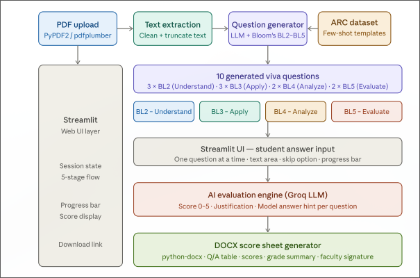
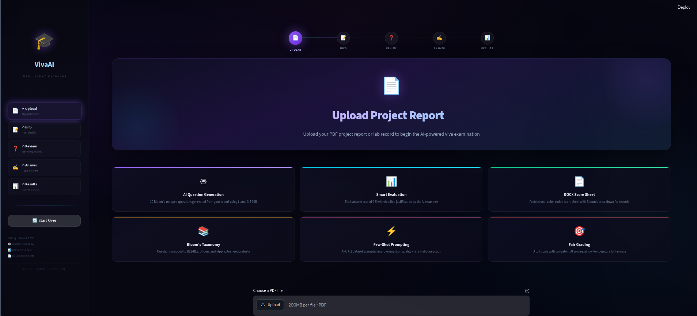
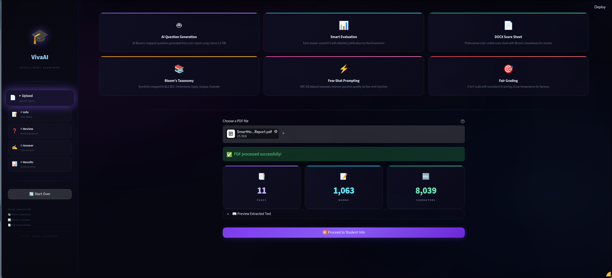
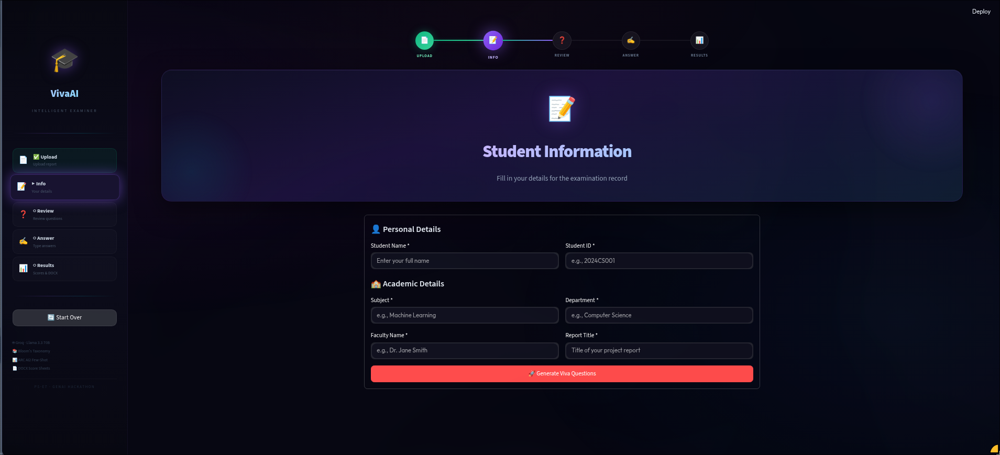
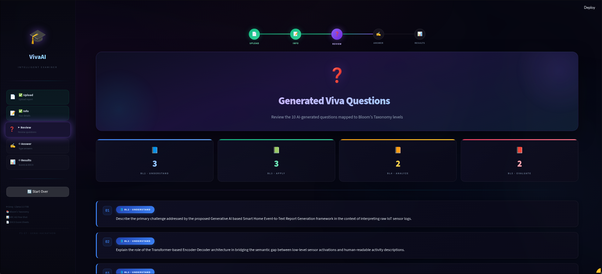
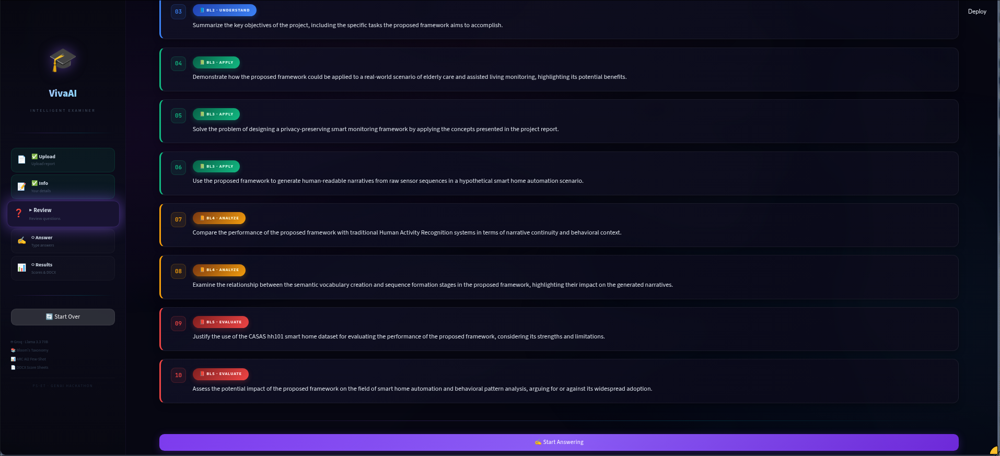
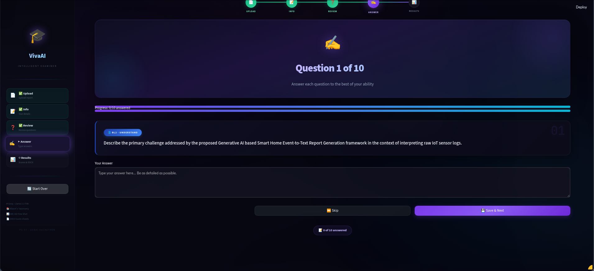
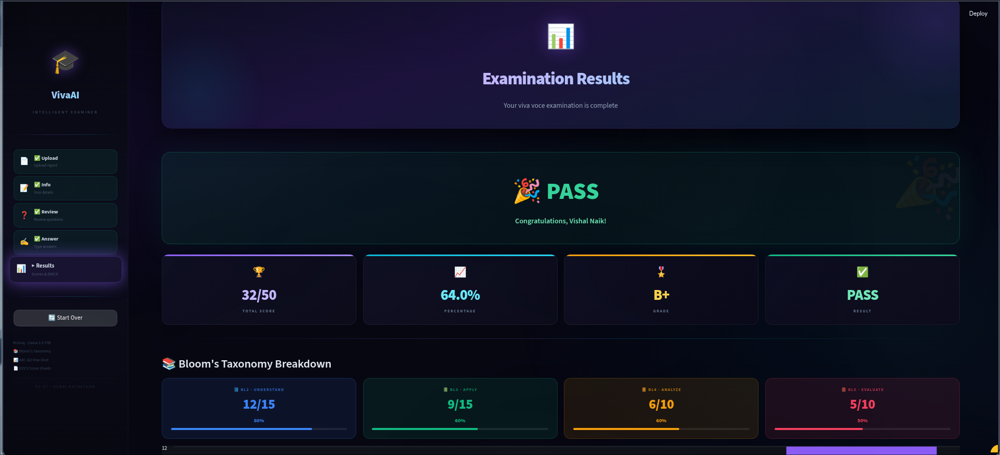

# 🎓 VivaAI — Automated Viva Voce Question Generator & Evaluator

> **PS-E7 · GenAI Hackathon**

An AI-powered Streamlit web application that reads student project reports, generates **Bloom's Taxonomy-mapped viva questions** using Llama 3.3 70B, evaluates answers with AI scoring, and produces professional **DOCX score sheets**.

---

## 📸 Screenshots

### System Architecture


### Stage 1 — Upload PDF


### PDF Extraction Results


### Stage 2 — Student Information


### Stage 3 — Generated Viva Questions



### Stage 4 — Answering Questions


### Stage 5 — Examination Results


---

## ✨ Features

| Feature | Description |
|---------|-------------|
| 📄 **PDF Extraction** | Dual-strategy: PyPDF2 (fast) + pdfplumber (fallback for complex layouts) |
| 🤖 **AI Question Generation** | 10 Bloom's Taxonomy-mapped questions using Groq Llama 3.3 70B |
| 📚 **Bloom's Taxonomy** | BL2 (Understand) × 3, BL3 (Apply) × 3, BL4 (Analyze) × 2, BL5 (Evaluate) × 2 |
| 📊 **AI Evaluation** | Score 0-5 per question with justification and model answer hint |
| 📝 **DOCX Score Sheet** | Professional color-coded document with Bloom's breakdown |
| ⚡ **Few-Shot Learning** | ARC AI2 dataset examples improve question quality |
| 🎯 **Fair Grading** | Temperature 0.3 for consistent scoring, O to F grade scale |

---

## 🏗️ Architecture

```
Student uploads PDF
       │
       ▼
┌──────────────────────┐
│  pdf_extractor.py    │  PyPDF2 → pdfplumber (fallback)
│  extract_and_clean() │  Clean → Truncate to 8000 chars
└──────────┬───────────┘
           │
           ▼
┌──────────────────────┐     ┌─────────────────────┐
│  question_gen.py     │◄────│  dataset_loader.py  │
│  generate_questions()│     │  ARC AI2 few-shot    │
│  Groq API, temp=0.7  │     │  examples            │
└──────────┬───────────┘     └─────────────────────┘
           │  10 questions (JSON)
           ▼
    Student answers (one-by-one)
           │
           ▼
┌──────────────────────┐
│  evaluator.py        │  Groq API, temp=0.3
│  evaluate_answer()   │  Score 0-5 + justification
└──────────┬───────────┘
           │
           ▼
┌──────────────────────┐
│  docx_generator.py   │  python-docx + OOXML
│  generate_score_sheet│  Color-coded .docx file
└──────────────────────┘
```

---

## 📁 Project Structure

```
viva_generator/
├── app.py                      # Main Streamlit application (5-stage state machine)
├── requirements.txt            # Python dependencies
├── .env.example                # Environment variable template
│
├── modules/
│   ├── __init__.py             # Package initialization
│   ├── pdf_extractor.py        # PDF text extraction (PyPDF2 + pdfplumber)
│   ├── dataset_loader.py       # ARC AI2 dataset loading & few-shot formatting
│   ├── question_gen.py         # LLM question generation (Groq API)
│   ├── evaluator.py            # LLM answer evaluation & grading
│   └── docx_generator.py       # DOCX score sheet generation
│
├── prompts/
│   ├── question_prompt.txt     # Question generation prompt template
│   └── eval_prompt.txt         # Answer evaluation prompt template
│
├── datasets/                   # Cached ARC examples (auto-generated)
├── outputs/score_sheets/       # Generated DOCX files
├── Images/                     # Screenshots & diagrams
└── docs/
    ├── DETAILED_DOCUMENTATION.md   # Complete technical deep-dive
    └── DEMO_SCRIPT.md              # Presentation talking points
```

---

## 🚀 Quick Start

### Prerequisites
- Python 3.10+
- Free [Groq API Key](https://console.groq.com/) (no credit card required)

### Installation

```bash
# Clone the repository
git clone <repo-url>
cd viva_generator

# Create virtual environment
python -m venv venv
source venv/bin/activate      # Linux/Mac
# venv\Scripts\activate       # Windows

# Install dependencies
pip install -r requirements.txt

# Configure environment
cp .env.example .env
# Edit .env and add your GROQ_API_KEY
```

### Running

```bash
streamlit run app.py
```

Open `http://localhost:8501` in your browser.

---

## ⚙️ Environment Variables

| Variable | Required | Description |
|----------|----------|-------------|
| `GROQ_API_KEY` | ✅ Yes | Free API key from [Groq Console](https://console.groq.com/) |
| `HF_TOKEN` | ❌ Optional | HuggingFace token for faster ARC dataset downloads |

---

## 📊 Bloom's Taxonomy Distribution

| Level | Code | Questions | Max Score | Cognitive Verbs |
|-------|------|-----------|-----------|-----------------|
| Understand | BL2 | 3 | 15 | Describe, Explain, Summarize |
| Apply | BL3 | 3 | 15 | Demonstrate, Solve, Apply, Use |
| Analyze | BL4 | 2 | 10 | Compare, Differentiate, Examine |
| Evaluate | BL5 | 2 | 10 | Justify, Assess, Critique, Argue |
| **Total** | | **10** | **50** | |

---

## 🎯 Grading Scale

| Percentage | Grade | Result |
|-----------|-------|--------|
| ≥ 90% | O (Outstanding) | ✅ Pass |
| ≥ 80% | A+ (Excellent) | ✅ Pass |
| ≥ 70% | A (Very Good) | ✅ Pass |
| ≥ 60% | B+ (Good) | ✅ Pass |
| ≥ 50% | B (Average) | ✅ Pass |
| ≥ 40% | C (Pass) | ✅ Pass |
| < 40% | F (Fail) | ❌ Fail |

---

## 🧠 Key Technical Decisions

| Decision | Rationale |
|----------|-----------|
| **Temp 0.7 for questions** | Higher creativity → diverse, interesting questions |
| **Temp 0.3 for evaluation** | Lower temp → consistent, fair scoring |
| **8,000 char truncation** | Fits LLM context window while capturing key content |
| **Dual PDF extraction** | PyPDF2 is fast; pdfplumber handles edge cases |
| **ARC few-shot examples** | Shows the LLM what good questions look like |
| **Deferred scoring** | Students aren't biased by seeing scores during answering |
| **Score clamping [0,5]** | Safety net against LLM returning out-of-range values |
| **Blank answer bypass** | Saves API quota — no call for empty answers |

---

## 📄 Documentation

- [📖 Detailed Technical Documentation](docs/DETAILED_DOCUMENTATION.md) — Complete deep-dive into every module
- [🎤 Demonstration Script](docs/DEMO_SCRIPT.md) — Presentation talking points with timing

---

## 🛠️ Tech Stack

| Technology | Purpose |
|-----------|---------|
| [Streamlit](https://streamlit.io/) | Web framework |
| [Groq](https://groq.com/) | LLM inference (free tier) |
| [Llama 3.3 70B](https://llama.meta.com/) | Large Language Model |
| [PyPDF2](https://pypdf2.readthedocs.io/) | PDF text extraction |
| [pdfplumber](https://github.com/jsvine/pdfplumber) | PDF fallback extraction |
| [python-docx](https://python-docx.readthedocs.io/) | DOCX generation |
| [HuggingFace Datasets](https://huggingface.co/datasets) | ARC AI2 few-shot data |

---

<p align="center">
  <b>PS-E7 · GenAI Hackathon · VivaAI</b><br>
  Built with ❤️ using Streamlit + Groq + Llama 3.3 70B
</p>
